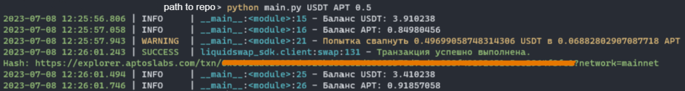
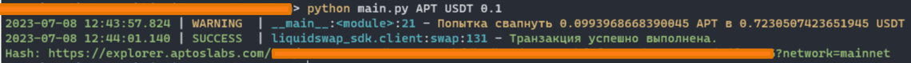

# aptos-liquidswap-swap

Скрипт для свапов в сети Aptos с использованием DEX Liquidswap

#### Установка зависимостей: ```pip install -r requirements.txt```

- `wallet.json` для ввода адреса и приватника от кошелька в json формате
- `config.py`  дефолтные настройки
- `tokens_mapping` в `config.py` используется для мапинга токенов (если вам надо какой-то еще, то просто добавьте
  удобное для вас название и адрес нового токена)

В файле `results.txt` будет записан ответ в формате:

### Примеры использования

Для ввода `from_token`, `to_token`, `amount` (надеюсь по названию понятно что это) используются аргументы командной
строки.

Такой формат выбран для того, чтобы в дальнейшем добавить еще 2 свапалки и стейк на топазе, а после связать это все
одним скриптом, который будет иметь возможность использовать N акков, делать паузы между свапами, работать в N потоков.
Да и камон, все делают настройку свапа через конфиг, что супер неудобно. Через аргументы командной строки я сделаю
за 5 минут из скрипта работу в многопоточном режиме с нужными мне настройками под каждый свап, а не буду менять что-то
в конфиге после каждого свапа.

#### Формат команды с аргументами:

`python main.py from_token to_token amount`

1. Первый аргумент: `from_token`, указывает из какого токена делать свап

2. Второй аргумент: `to_token`, указывает в какой токен делать свап

3. Третий аргумеет: `amount`, указывает количество монет для свапа

#### Для свапа 0.5 USDT в APT нужно ипользовать команду:

`python main.py USDT APT 0.5`

#### Для свапа 0.7 APT в USDT нужно ипользовать команду:

`python main.py APT USDT 0.7`

#### Для свапа 1 USDT в BTB.B нужно ипользовать команду:

`python main.py USDT BTCB 1`

### Пример работы

Свап 0.5 USDT в APT



Свап 0.1 APT в USDT



### Благодарочка _(если вдруг вы щедрая душа)_

Поставьте звездочку на гитхабе, также можно заминтить статью на Mirror за 0.001 eth:

**https://mirror.xyz/byxmend.eth/8OfnONh5iAryAx-_NALi7LOp_W-dpaQCXnI-QR-MoaQ**

Или закинуть скам токенов на кошелек :)

**EVM: 0x96C22103635501D380B4F2a44C815EA460693E13**

### Telegram https://t.me/sybil_v_zakone

_В основе лежит репозиторий: https://github.com/WayneAl/liquidswap-sdk-python_
